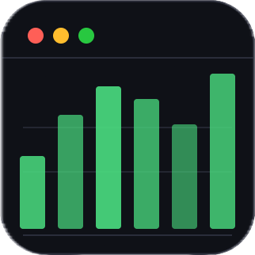
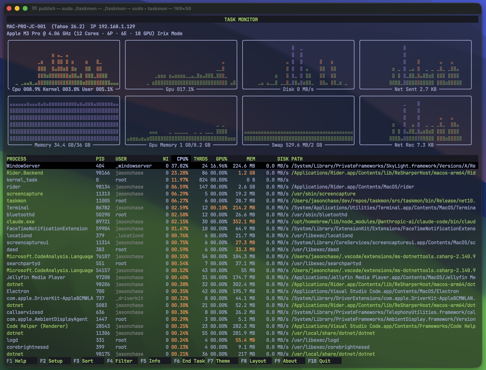
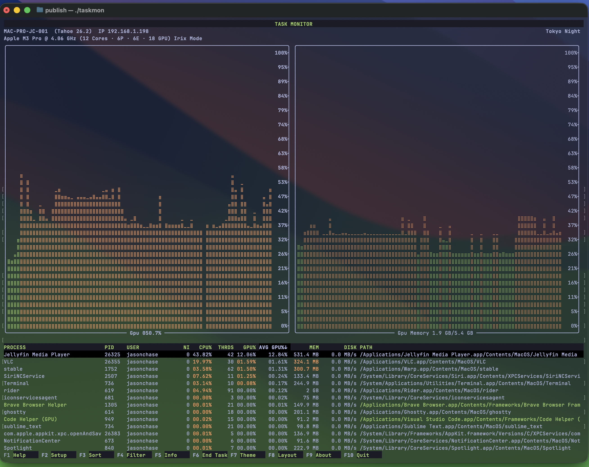

<h1>
  
  Task Monitor
</h1>
<p>A modern, powerful cross-platform terminal-based task monitor providing real-time monitoring and management of a computer's performance, active processes, and resource utilization. Perfect for Homelab and local LLM monitoring. 
Originally inspired by tools like <b>top</b>, <b>htop</b> and the <b>Windows Task Manager</b>, it provides performance monitoring at-a-glance for system resources (including CPU, GPU, Memory, Swap, Disk and Network) and process management functions.</p>

[](#macos-on-apple-silicon)
[](#windows-on-x64-and-arm64)

[](#macos-on-apple-silicon)
[](#windows-on-x64-and-arm64)
[](#linux-distros)






## Features

- **Perfect for HomeLab and Local LLM monitoring**
- **No sudo or administrator privilege required** 
- **Real-Time System Monitoring**: Live updates of CPU, GPU, memory, swap, disk I/O and Network I/O.
- High resolution charts in 24-bit color.
- Switch layouts (`F8`) to focus charts on specific system metrics. 
- **Real-Time Process Monitoring**: View Process, Pid, CPU%, Avg CPU%, Max CPU%, Threads, GPU%, Avg GPU%, Max GPU%, Memory, Avg Memory, Max Memory, Disk MB/s, Avg Disk MB/s, Max Disk MB/s and Command Path.
- Process list formatted similar to the original **htop** and **top**. 
- Process CPU% defaults to Irix mode (individual core saturation) for *nix systems (`i` to toggle on/off).
- Process deep dive (`F5`) to view live thread times and loaded libraries (system and user).
- **Module Analysis**: Full dynamic and static library enumeration for selected process.
- Customize update interval (default 1500ms).
- Customize top number of processes to display (default unlimited).
- Customize number of process iteration loops.
- Freeze process list updates (`f` or `z`).
- **Windows Services**: Show service names and startup parameters, not just generic `svchost.exe` entries.
- Multiple process selection (`x` toggle show checkboxes, `spacebar` for selection, `u` to uncheck all selections)
- Select and terminate multiple processes simultaneously (`F6`).
- Filter by process name, username, command path or PID (`F4`).
- Sort the process list by any visible column (`F3`).
- Quick sort by CPU%, GPU% or Memory (`p`, `g` or `m` respectively). 
- Toggle process sorting between ascending (using the `a` key) and descending (using the `d` key).
- Navigate scrollable lists using the &#x2193;, &#x2191; arrow keys and `Pg Up` and `Pg Down` keys.  
- **Multiple Themes**: Ships with dozens of popular, modern 24-bit color themes.
- Modern terminal detection to support color desaturation.
- **Customize Configuration**: Manage configuration settings using the (`F2`) Setup function. Interactive UI for modifying and saving settings.
- **System profile**: Display machine name, OS name and version, CPU name and clock speed, top resource consumers (Avg and Max) (using the `F9` function).

**Cross-Platform Native Performance**
- Platform-specific optimizations using C APIs (Win32,  Mach kernel). 
- .net native build with small memory footprint.
- Zero third-party dependencies on libraries such as ncurses.

## Installation

Note: taskmon does NOT require the .net SDK or runtime to be installed on any platform to run. The application is a native-code, self-contained executable on all platforms.

### macOS on Apple Silicon

[](#macos-on-apple-silicon)
The easiest way to install on macOS ARM64 (Apple Silicon) is using homebrew:

```bash
brew tap jchas2/taskmon
brew trust jchas2/taskmon
brew install taskmon
```

To update to the latest version:

```bash
brew update
brew upgrade taskmon
```

Task Monitor does not require sudo permission on MacOS for system monitoring, however some system process detail won't be available unless run with sudo.

### Windows on x64 and ARM64

[](#windows-on-x64-and-arm64)
The easiest way to install on Windows is using chocolately (pending):

```powershell
choco install taskmon
```

To update to the latest version:

```powershell
choco upgrade taskmon
```

### Windows (Direct Download)

- [Windows x64](https://github.com/jchas2/taskmon/releases/latest)
- [Windows ARM64](https://github.com/jchas2/taskmon/releases/latest)

After downloading:
1. Extract the archive
2. Run PowerShell or Command Prompt, then run `.\taskmon.exe`

Task Monitor does not require elevated permission on Windows for system monitoring, however some system process detail won't be available unless run as Administrator.

### Linux Distros

Task Monitor is not yet available on Linux (coming soon).

## Usage

Task Monitor supports the following commands on startup. Note these commands can also be configured using the F2 Setup function, and saved to configuration for next run.

| Command | What it does |
|---------|--------------|
| `taskmon` | Start Task Monitor with configuration defaults. |
| `taskmon --gpu-only` | Automatically monitor GPU resources on startup. |
| `taskmon --cpu-only` | Automatically monitor CPU resources on startup. |
| `taskmon --pid <pid>` | Automatically monitor the pid nnn on startup. |
| `taskmon --username <username>` | Automatically monitor all processes running under user username on startup. |
| `taskmon --process <processname>` | Automatically monitor all processes with matching processname on startup. |
| `taskmon --sort <column>` | Automatically sort by <column> on startup. |
| `taskmon --sort-help` | Show the list of columns available for the `--sort` option. |
| `taskmon --delay <delay>` | Use <delay> in milliseconds between chart and process updates. |
| `taskmon --limit <limit>` | Limit the number of iteration loops and then stop. |
| `taskmon --nprocs <nprocs>` | Only display the top number of processes. Eg: `taskmon --nprocs 10` |
| `taskmon --theme <theme>` | Load a theme <theme> from the available themes. Eg: `taskmon --theme "Dracula Official"` |
| `taskmon --theme-help` | Show the list of theme names available for the `--theme` option. |
| `taskmon --debug` | Signal a debug break on startup and wait for a debugger to attach. |
| `taskmon --version` | Print version information and exit. |
| `taskmon --help` | Show help and usage information. |

## Configuration

Task Monitor stores configuration and log files in the following system directories:

| Config | Description |
|--------|-------------|
| `taskmon.ini` | Primary config file in .ini format. |
| Theme files | One config file per theme. |
| Layout files | One layout file per TUI layout. Controls size and types of charts on display. | 
| Log files | One log file per session; logs are rotated > 2MB and routinely deleted. |

### MacOS

| Config | Path |
|--------|------|
| `taskmon.ini` | `~\.config\taskmon` |
| Theme files |  `~\.config\taskmon\themes` |
| Layout files | `~\.config\taskmon\layouts` | 
| Log files | `~\Library\Logs\taskmon` |

### Windows

| Config | Path |
|--------|------|
| `taskmon.ini` | `~\AppData\Roaming\taskmon` |
| Theme files |  `~\AppData\Roaming\taskmon\themes` |
| Layout files | `~\AppData\Roaming\taskmon\layouts` | 
| Log files | `~\AppData\Local\taskmon\Logs` | 

## Theme Files

Theme files control the color palette behavior for color desaturation, background opacity, and the colors applied to the TUI screen elements.
Theme files use the ini file format (see example below). Any modifications to default/shjpped theme files will be reset automatically when 
taskmon updates. To create new, custom themes, simply copy an existing theme and modify the settings as required.
These files will automatically be available next time Task Monitor starts.

Below is an example theme file:
```
;=============================================================================
; Task Monitor (taskmon) - Built-in Theme
;=============================================================================
; IMPORTANT:
; Any modifications to default/shipped theme files will be reset automatically
; when taskmon runs or updates.
;
; How to create a custom theme:
;   Step 1: Copy this file to a new name (e.g. "Tokyo Night Custom.theme").
;   Step 2: Rename the header "[Tokyo Night]" to "[Tokyo Night Custom]".
;   Step 3: Customize color hex values (#RRGGBB).
;=============================================================================

[Dracula Official]
colour-mode=indexed

background=transparent
background-highlight=#3b5070

chart-border=#a9b1d6
chart-y-axis=#9ece6a

col-cmd-normal-user-space=#50fa7b
col-cmd-low-priority=#0000FF
col-cmd-high-cpu=#ff79c6
col-cmd-io-bound=#bd93f9
col-cmd-script=#e3b341
col-user-current-non-root=#f8f8f2
col-user-other-non-root=#f1fa8c
col-user-system=#ff79c6
col-user-root=#50fa7b

command-foreground=#bd93f9
command-background=#282a36

delta-highlight-colour=#ffb86c

error=#db61a2

foreground=#f8f8f2
foreground-highlight=#ffb86c

menubar-foreground=#f1fa8c
menubar-background=#282a36

range-high-background=#bd93f9
range-low-background=#f1fa8c
range-mid-background=#ffb86c
range-high-foreground=#000000
range-low-foreground=#000000
range-mid-foreground=#000000

header-background=#282a36
header-foreground=#f1fa8c
```

| Example Theme | Description |
| --- | --- |
| `[Dracula Official]` | Theme name, used to identify the theme. |
| `colour-mode=indexed` | `Indexed` means use the color palette that supports color desaturation on modern terminals. `Truecolour` prevents desaturation (by emitting ARGB) escape codes. `Auto` detects terminal support. |
| `background=transparent` | `transparent` honors background color opacity settings in the terminal. Otherwise specify a custom background color to override the terminal default. |
| `background-highlight=#3b5070` | Row selection background color in a list. |

| `chart-border=#f8f8f2` | Chart border color. |
| `chart-y-axis=#50fa7b` | Text color for chart Y-axis scale. |

| `col-cmd-normal-user-space=#50fa7b` | Text color for user-mode applications. |
| `col-cmd-low-priority=#0000FF` | Text color for applications running at a low priority. |
| `col-cmd-high-cpu=#ff79c6` | Text color for a process running at high CPU%. |
| `col-cmd-io-bound=#bd93f9` | Text color for a process that is IO bound. |
| `col-cmd-script=#e3b341` | Text color for script/shell processes. (not supported yet) |
| `col-user-current-non-root=#f8f8f2` | Username color for current user if not running as root. |
| `col-user-other-non-root=#f1fa8c` | Username color for other non-root users. |
| `col-user-system=#ff79c6` | Text color for system users. |
| `col-user-root=#50fa7b` | Text color for root/admin users. |
| `command-foreground=#bd93f9` | Function Key text color. |
| `command-background=#282a36` | Function key background color. |
| `delta-highlight-colour=#ffb86c` | Flash color when a metric updates in the process list. |
| `error=#db61a2` | Text error color. |
| `foreground=#f8f8f2` | Text foreground color. |
| `foreground-highlight=#ffb86c` | Row selection foreground color in a list. |
| `menubar-foreground=#f1fa8c` | Menubar text color. |
| `menubar-background=#282a36` | Menubar background color. |
| `range-high-background=#bd93f9` | Chart color for high-range values. |
| `range-low-background=#f1fa8c` | Chart color for low-range values. |
| `range-mid-background=#ffb86c` | Chart color for mid-range values. |
| `range-high-foreground=#000000` | Text color for high-range values. |
| `range-low-foreground=#000000` | Text color for low-range values. |
| `range-mid-foreground=#000000` | Text color for mid-range values. |
| `header-background=#282a36` | Column header background color in a list. |
| `header-foreground=#f1fa8c` | Column header foreground color in a list. |

Note: ```colour-mode``` can be temporarily overridden for ALL theme files by setting the environment variable ```TASKMON_COLOUR_MODE``` to one of ```Indexed```, ```Truecolour``` or ```Auto```. ```Auto``` will support the theme setting if the terminal supports it.

## Layout Files

Layout files control the number, sequence, rows and columns of the chart layouts on the main process screen. There are a number of default layouts that are pre-loaded when Task Monitor starts. 
These layouts are kept in .ini files and can be customized as required. Additionally, new layout
files can be authored and copied to the layout files directory and will automatically be available next time Task Monitor starts.

Below is an example Layout file:

```
[All Charts]
ratio=0.4
num-rows=2
num-cols=4
; Chart index
; 0=Cpu, 1=Gpu, 2=Disk, 3=NetworkSent, 4=Memory, 5=GpUMemory, 6=VirtualMemory, 7=NetworkRec 
charts=0,1,2,3,4,5,6,7
```

| Example Layout | Description |
| :--- | :--- |
| `[All Charts]` | Layout name, used to identify the layout. |
| `ratio=0.4` | Percentage of the screen Y-axis used to display chart content i.e. 40%. |
| `num-rows=2` | Number of rows to split the charts across. |
| `num-cols=4` | Number of columns to show each chart. |
| `; Chart index` | |
| `; 0=Cpu, 1=Gpu, 2=Disk, 3=NetworkSent, 4=Memory, 5=GpUMemory, 6=VirtualMemory, 7=NetworkRec` | Chart identifiers. |
| `charts=0,1,2,3,4,5,6,7` | Array of chart identifiers to render across the rows and columns. |

## Development Guide

This section covers everything you need to know to build, test, debug, and contribute to `taskmon`.

### Prerequisites

*   [.NET 10.0 SDK](https://dotnet.microsoft.com/download/dotnet/10.0) or newer.
*   A compatible OS and Architecture:
    *   **macOS**: Apple Silicon (`osx-arm64`). *Intel Macs (`osx-x64`) are not supported.*
    *   **Windows**: x64 (`win-x64`).

### Building the Project

The repository includes cross-platform build scripts in the root directory that wrap the underlying .NET CLI commands and engineering scripts (`eng/`).

**macOS (Bash):**
```bash
./build.sh
```

**Windows (PowerShell):**
```powershell
.\build.ps1
```

By default, these scripts perform a clean build using the `Debug` configuration. Under the hood, they invoke `eng/build.sh` or `eng/build.ps1`. 
You can pass custom arguments to the underlying scripts:
*   `--clean`: Clean the solution.
*   `--restore`: Restore NuGet packages.
*   `--build`: Build the solution.
*   `-c <config>`: Specify configuration (e.g., `Release`).

### Running Tests

The project uses **xUnit** and **Moq** for testing. Test projects are located in the `tests/` directory.

To run the full test suite:

**macOS:**
```bash
./test.sh
```

**Windows:**
```powershell
.\test.ps1
```
*(This is equivalent to running `./eng/build.sh --test`)*

### Publishing

To build self-contained, Native AOT-compiled binaries for release:

**macOS:**
```bash
./publish.sh
```

**Windows:**
```powershell
.\publish.ps1
```
*(This cleans, builds, and publishes using the `Release` configuration).*

The output will be located in `src/taskmon/bin/Release/net10.0/<runtime>/publish/`.

### Debugging

To debug the CLI application, you can instruct it to pause on startup and wait for a debugger to attach. This is useful when issues
or behaviors can't be reproduced in IDE consoles, or are specific to the terminal host (i.e. Powershell, conhost, Terminal, Ghostty, etc).

1.  Run the application with the `--debug` flag:
    ```bash
    taskmon --debug
    ```
2.  The application will print its Process ID (PID) and wait:
    `Waiting for debugger attach to Pid 12345`
3.  Attach your IDE's debugger to the specified PID.
4.  Once attached, the application will trigger a `Debugger.Break()` and you can step through the code.

### Writing Code / Project Structure

*   **Interop Layer**: All native OS calls are isolated in `Task.Monitor.Interop.Mach` (macOS) and `Task.Monitor.Interop.Win32` (Windows). If you need to add a new OS metric, define the P/Invoke signatures here.
*   **System Abstraction**: The `Task.Monitor.System` project consumes the Interop layer to provide cross-platform models (e.g., `SystemStatistics`, `ProcessInfo`). The TUI rendering framework also lives in this library.
*   **UI/CLI**: The `taskmon` project contains the main application logic, rendering, and terminal UI layouts.
*   **Themes/Layouts**: Custom terminal themes and layouts are stored as embedded resources in `src/taskmon/Assets/`.
*   **Test Projects**: There is a matching test project for every application project.

### Dependencies
This project contains no dependencies on third party .net libraries. The early iterations of the system layer functionality used
a number of libraries and the memory footprint for the tool quickly climbed to several hundred MB. Keeping the CPU and memory footprint as low as possible for a .net native application is a key design goal.

## Acknowledgments

- The original `htop` https://github.com/htop-dev/htop
- MacOS `top` https://github.com/apple-open-source/macos/tree/master/top
- The .net framework authors https://github.com/dotnet
- The WinForms authors: the TUI framework design in this project was modeled on the WinForms object and eventing models, to provide a clean, simple API for working with the underlying terminal. 
