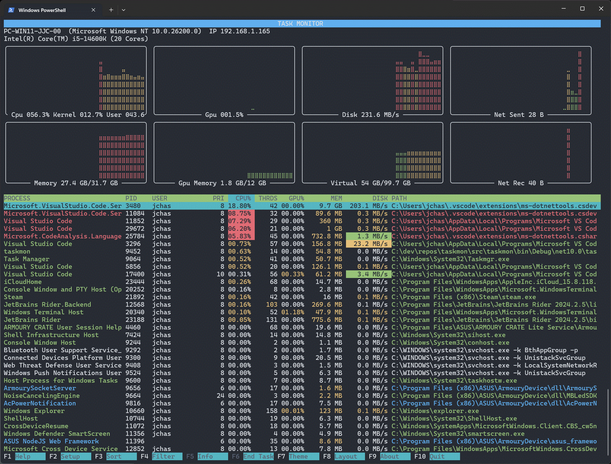

<h1>
  
  taskmgr-cli
</h1>
A powerful, cross-platform terminal-based task monitor designed to provide real-time monitoring and management of a computer's performance, active processes, and resource utilization. 
Originally inspired by tools like top, htop and the Windows Task Manager, it provides performance monitoring for system resources (including CPU, GPU, Memory, Disk and Network) and process
management functions.



## Features

### Core Capabilities

- **Real-Time Process Monitoring** - Live updates of CPU & GPU, memory, disk I/O, Network I/O and thread counts
- **Advanced Process Information** - View detailed module lists, thread states, and command-line arguments (platform dependent)
- **Multi-Process Selection** - Select and terminate multiple processes simultaneously
- **Smart Filtering** - Filter by process name, username, or PID
- **Flexible Sorting** - Sort by any column (Process, PID, User, Priority, CPU%, Threads, GPU%, Memory, Disk, Path)
- **Rich System Metrics** - Visual meters for CPU, GPU, memory usage, Virtual/Swap, Disk and Network
- **Keyboard-Driven Interface** - Full F1-F10 hotkey support for navigation

### Customization

- **5 Built-in Themes** - Colour, Mono, MS-DOS, Tokyo Night, and Matrix
- **Configurable UI** - 26 customizable color keys per theme
- **Adjustable Performance** - Configurable update intervals and process display limits
- **IRIX Mode** - Toggle between per-core and total CPU reporting per process

### Deep Process Insights
- **Thread-Level Information**: View individual thread states, CPU times, and priorities to verify process state
- **Windows Service Details**: Shows actual service names and startup parameters, not just generic `svchost.exe` entries
- **Module Analysis**: Full DLL/library enumeration for each process (Currently Windows only)

**Cross-Platform Native Performance**
- Platform-specific optimizations using native APIs (Win32,  Mach kernel, IOKit, IOReport, CoreFoundation)
- No generic cross-platform wrappers - direct system calls for maximum performance

## Installation

### macOS (Homebrew)

The easiest way to install on macOS ARM64 (Apple Silicon):

```bash
brew tap jchas2/taskmon
brew install taskmon
```

To update to the latest version:

```bash
brew update
brew upgrade taskmon
```

Taskmgr does not require sudo permission on MacOS for system monitoring, however some system process detail won't be available unless run with sudo.

### Windows

- [Windows x64](https://github.com/jchas2/taskmon/releases/latest)

After downloading:
1. Extract the archive
2. Run PowerShell or Command Prompt, then run `.\taskmon.exe`

Task Monitor does not require elevated permission on Windows for system monitoring, however some system process detail won't be available unless run as Administrator.

## Configuration

Configuration is managed through the F2 Setup function in the terminal UI. The raw config file is in .ini format and can also be edited manually.
Configuration is stored in `taskmon.ini` in the application directory.
